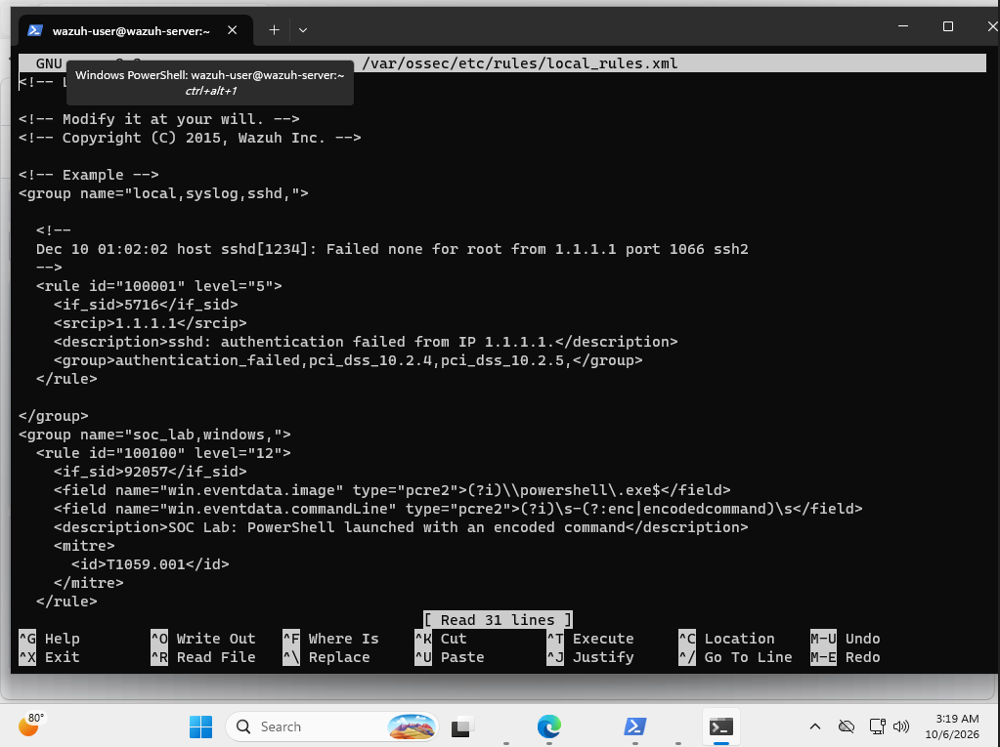
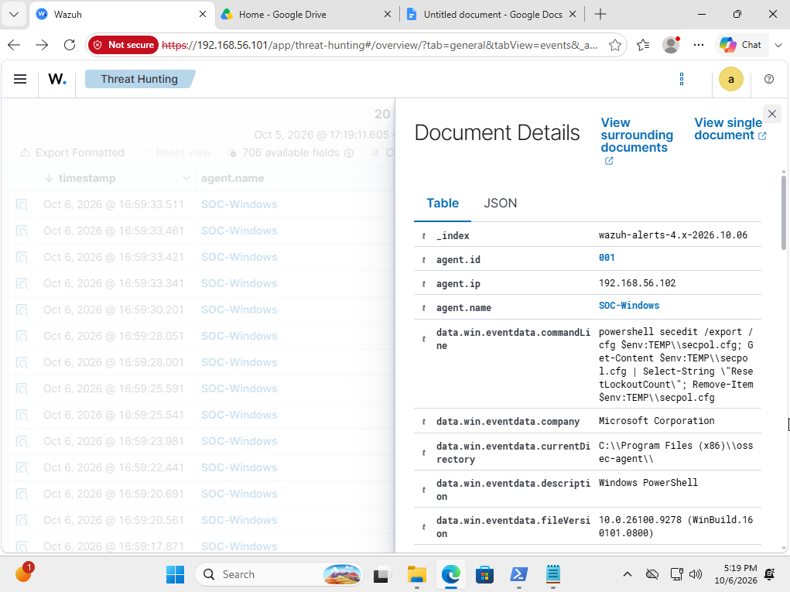

# PowerShell Detection and Investigation with Wazuh and Sysmon

A SOC home lab focused on collecting Windows process telemetry, investigating PowerShell alerts, and validating a custom Wazuh rule with harmless simulations.

## Results

- Forwarded Sysmon events from a Windows endpoint to Wazuh.
- Investigated alerts using command lines, parent processes, and user context.
- Created a custom rule extending an existing encoded PowerShell detection.
- Verified that an encoded command triggered the custom rule while a normal command matched a different built-in rule.

All test activity was authorized and performed in my own lab. No malware was used.

## Lab environment

| Component | Purpose |
|---|---|
| VirtualBox | Runs the two virtual machines |
| Windows 11 Enterprise evaluation | Monitored endpoint |
| Sysmon | Records detailed process activity |
| Wazuh agent | Collects and forwards configured Windows events |
| Wazuh server and dashboard | Analyzes events and displays alerts |

The VMs communicate over a shared host-only network. Each also has a NAT adapter for outbound internet access. The host-only network is separate from my physical LAN, but the VMs are not air-gapped.

## Log collection

I configured the Windows Wazuh agent to collect the Sysmon Operational channel:

```xml
<localfile>
  <location>Microsoft-Windows-Sysmon/Operational</location>
  <log_format>eventchannel</log_format>
</localfile>
```

I verified collection in stages: local Sysmon process events, the agent's collection log, and alerts appearing in the Wazuh dashboard.

## Investigation: PowerShell file deletion alert

Wazuh generated rule `92021`, describing PowerShell being used to delete files or directories.

I examined the command and its parent process. The parent was `wazuh-agent.exe`. The command exported Windows security settings to a temporary file, searched for the `ResetLockoutCount` setting, and removed the temporary file.

Assessment: likely benign security configuration checking and cleanup, based on the observed command and parent context.

The lesson was to investigate the activity behind an alert rather than treat its description or MITRE mapping as proof of an attack.

## Custom detection

Custom rule `100100` extends built-in rule `92057`. It identifies the tested pattern of PowerShell launching another PowerShell process with an encoded command.

The rule checks the executable path and the `-enc` or `-EncodedCommand` argument. It retains level `12` and maps to MITRE ATT&CK `T1059.001` — PowerShell.

This is a customization of an existing Wazuh detection, not a claim to have discovered a new technique.

## Detection rule and evidence

[View the custom rule](rules/encoded-powershell.xml)

### Custom detection triggered

The harmless encoded PowerShell test matched custom rule `100100` at level `12`.


### Normal command comparison

The normal command was collected and matched built-in rule `92027`, rather than the custom encoded command rule.


### Final rule configuration

The custom rule extends built-in rule `92057`.



### Investigation evidence

The command below exported security settings, searched for an account lockout setting, and removed the temporary file. Combined with its Wazuh agent parent process, this supported a likely benign assessment.



[View the built-in encoded PowerShell alert observed before customization](screenshots/19-builtin-encoded-powershell-alert.png)

## Validation results

| Test | Observed rule | Level |
|---|---|---|
| PowerShell launched another PowerShell process to delete a lab test file | Built-in `92027` | 4 |
| Harmless encoded command before the custom rule adjustment | Built-in `92057` | 12 |
| Harmless encoded command after the adjustment | Custom `100100` | 12 |
| Normal command printing a test message | Built-in `92027` | 4 |

The encoded test printed `SOC-LAB-ENCODED-TEST`. The normal comparison printed `SOC-LAB-NORMAL-TEST`.

Both commands were harmless. The detection distinguished their execution patterns, not their intent.

## Troubleshooting and lessons learned

- Corrected a mistyped Sysmon channel name after reviewing the agent log.
- Used SSH from Windows Terminal to manage the Linux server.
- Validated rule syntax before restarting the manager.
- Found that the first custom rule did not become the final matching rule for the encoded test.
- Changed the custom rule to explicitly extend built-in rule `92057`, then confirmed it matched a new test.
- Corrected the Windows display time zone before the final tests.

A rule passing syntax validation does not prove it detects the intended activity. Live testing was necessary.

## Limitations

- Validation covered a small number of controlled tests on one Windows endpoint.
- The custom rule depends on built-in rule `92057` and its matching conditions.
- The custom argument pattern covers `-enc` and `-EncodedCommand`; other forms were not validated.
- Encoded PowerShell can be legitimate and still requires investigation.
- This project does not demonstrate malware prevention, comprehensive PowerShell detection, or a measured reduction in false positives.
- Sysmon network connection logging was not enabled as part of this project.

## Skills practiced

Windows event analysis, Sysmon configuration, SIEM log collection, alert triage, process ancestry analysis, Wazuh rule customization, regular expressions, Linux administration, and detection validation.

## References

- [Wazuh custom rules](https://documentation.wazuh.com/current/user-manual/ruleset/rules/custom.html)
- [Wazuh Windows event collection](https://documentation.wazuh.com/current/user-manual/reference/ossec-conf/localfile.html)
- [Microsoft Sysmon documentation](https://learn.microsoft.com/en-us/sysinternals/downloads/sysmon)
- [MITRE ATT&CK: PowerShell](https://attack.mitre.org/techniques/T1059/001/)
