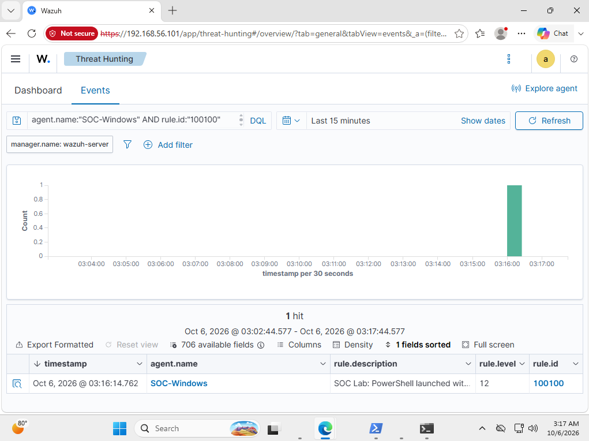
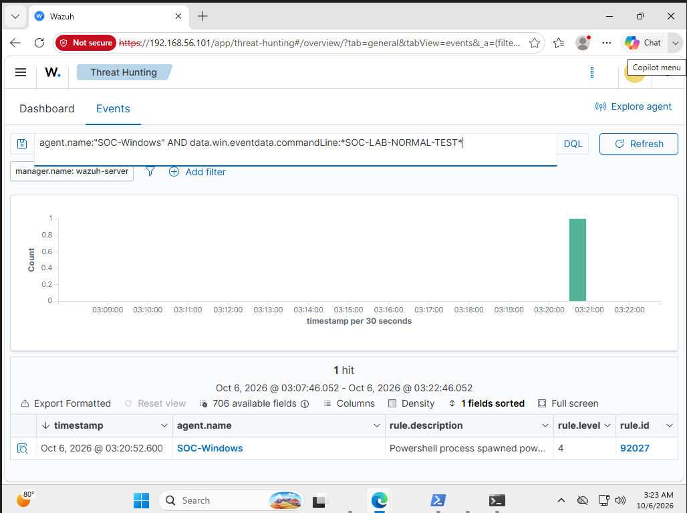

# Detection Testing

These tests use harmless commands in the SOC-Windows lab VM. They demonstrate detection behavior, not malicious activity.

## Prerequisites

- Sysmon is recording process creation events.
- The Wazuh agent collects Microsoft-Windows-Sysmon/Operational.
- The endpoint appears as SOC-Windows in Wazuh.
- Custom rule 100100 is installed and the manager has been restarted.

The repository's rules/encoded-powershell.xml contains the custom rule excerpt. Add it once to the manager's local rules configuration; do not load duplicate copies of rule 100100.

## Configuration validation

On the Wazuh server:

```bash
sudo /var/ossec/bin/wazuh-analysisd -t
echo $?
```

An exit code of 0 indicates configuration validation succeeded. It does not prove that the detection logic matches the intended events.

After successful validation:

```bash
sudo systemctl restart wazuh-manager
sudo systemctl is-active wazuh-manager
```

Expected service status: active.

## Test 1: Encoded PowerShell

Run in PowerShell inside SOC-Windows:

```powershell
$command = "Write-Output 'SOC-LAB-ENCODED-TEST'"
$encoded = [Convert]::ToBase64String([Text.Encoding]::Unicode.GetBytes($command))
powershell.exe -NoProfile -EncodedCommand $encoded
```

Expected console output:

```text
SOC-LAB-ENCODED-TEST
```

The command is converted to Base64 using UTF-16LE encoding. Base64 is encoding, not encryption.

In Wazuh Threat Hunting, select a time range containing the test and search:

```text
agent.name:"SOC-Windows" AND rule.id:"100100"
```

Observed result: custom rule 100100, level 12.



## Test 2: Normal PowerShell comparison

Run in PowerShell inside SOC-Windows:

```powershell
powershell.exe -NoProfile -Command "Write-Output 'SOC-LAB-NORMAL-TEST'"
```

Expected console output:

```text
SOC-LAB-NORMAL-TEST
```

Search Wazuh:

```text
agent.name:"SOC-Windows" AND data.win.eventdata.commandLine:*SOC-LAB-NORMAL-TEST*
```

Observed result: built-in rule 92027, level 4. The returned event did not match custom rule 100100.



Finding the normal event confirmed that it was collected. An empty search for the custom rule alone would have been weaker evidence.

## Troubleshooting the initial rule

The first custom rule used the sysmon_event1 group as its parent condition. The encoded test appeared under built-in rule 92057 instead of custom rule 100100.

I changed the custom rule to explicitly extend rule 92057 using:

```xml
<if_sid>92057</if_sid>
```

I retained level 12, validated the configuration, restarted the manager, and generated a new test event. The new event matched rule 100100.

## Interpretation and limitations

Both test commands were harmless. The custom rule distinguished the encoded execution pattern from the normal command.

The final rule depends on built-in rule 92057 and covers the tested PowerShell parent and child relationship. Its additional argument pattern checks -enc and -EncodedCommand without regard to letter case.

These results validate the two demonstrated cases. They do not establish coverage for every argument spelling, parent process, renamed executable, or PowerShell version.

An encoded command alert still requires investigation of the decoded content, user, parent process, and surrounding activity.
